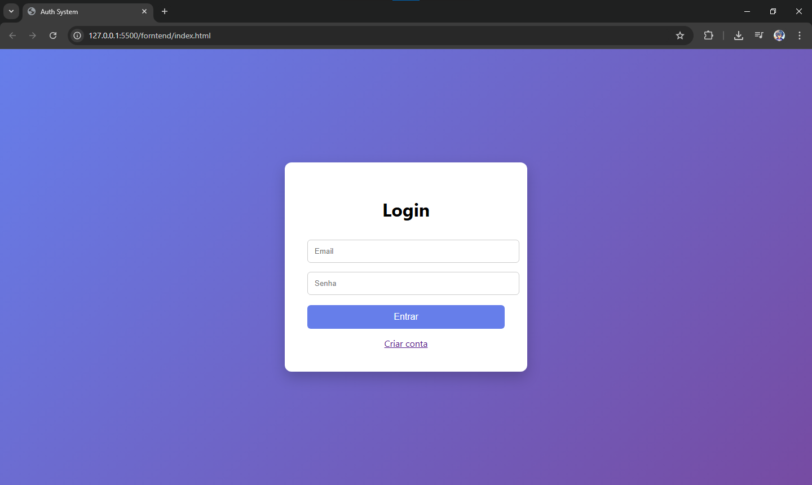

# 🔐 Sistema de Login Completo

Este projeto é uma aplicação simples de **autenticação de usuários**, desenvolvida para entender na prática como funciona a comunicação entre **front-end, back-end e banco de dados**.

A aplicação permite:

- Criar uma conta
- Fazer login
- Autenticar usuários
- Acessar uma área protegida (dashboard)

---

# 🚀 Tecnologias Utilizadas

### Front-end
- HTML
- CSS
- JavaScript

### Back-end
- Node.js
- Express

### Banco de Dados
- MySQL
- XAMPP

### Segurança
- bcrypt (criptografia de senha)
- JSON Web Token (JWT)

---

# 🧠 Conceitos Praticados

Durante o desenvolvimento deste projeto foram trabalhados conceitos importantes como:

- Comunicação entre **Front-end e Back-end**
- Criação de uma **API REST**
- **Autenticação de usuários**
- **Criptografia de senhas**
- **Armazenamento de dados no banco**
- Uso de **tokens JWT para proteger rotas**

---

# 🔑 Funcionalidades

### Cadastro de usuário
- Usuário cria uma conta com **nome, email e senha**
- A senha é **criptografada com bcrypt**
- Os dados são armazenados no **MySQL**

### Login
- O sistema verifica:
  - se o email existe
  - se a senha está correta
- Caso esteja correto, é gerado um **JWT Token**

### Autenticação
- O token é salvo no **localStorage**
- Ele é usado para acessar **rotas protegidas**

---

# 📡 Rotas da API

### Registrar usuário

POST /api/auth/register

Body:

{
"name": "Usuario",
"email": "email@email.com
",
"password": "123456"
}

---

### Login

POST /api/auth/login

Body:

{
"email": "email@email.com
",
"password": "123456"
}

---

### Perfil (rota protegida)

GET /api/auth/profile

Header:

Authorization: Bearer TOKEN

---

# 💻 Como rodar o projeto

### 1️⃣ Clonar o repositório

git clone https://github.com/seuusuario/login-project

---

### 2️⃣ Instalar dependências

npm install

---

### 3️⃣ Iniciar servidor

node server.js

ou

npm start

---

### 4️⃣ Iniciar banco de dados

Abra o **XAMPP** e ative:

- Apache
- MySQL

Depois crie o banco no **phpMyAdmin**.

---

# 📚 Aprendizados

Esse projeto foi desenvolvido com o objetivo de compreender melhor:

- Como funciona um **sistema real de autenticação**
- Como o **front-end se comunica com o back-end**
- Como armazenar e validar usuários em um **banco de dados**

---

# 🚀 Próximas melhorias

- Interface mais moderna
- Sistema de recuperação de senha
- Validação de formulários
- Deploy da aplicação

---

# 👨‍💻 Autor

Projeto desenvolvido como parte dos estudos em **Desenvolvimento Web**.